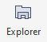
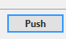

# Grundsätzliche Konzepte:
Jedes Bild benötigt eine zusätzliche Datei, die Informationen zu dem Bild enthält. Das sind zum Beispiel Format, Größe und Name des Bildes.
Die Datei MUSS genauso heißen, wie die Bilddatei, aber statt auf __.png__ oder __.jpg__ zu enden, muss sie auf __.ini__ enden. 
Beispiel:

Die Datei hat folgenden Inhalt:
```ini
[Metadata]
Title=2023-1
Year=2023
Material=Acryl, Kohle und Tusche auf Papier
Format=50 x 70 cm
Status=Verkauft
```
Alles hinter dem `=` Zeichen sind Informationen, die du verändern kannst, alles davor muss so bleiben, wie es ist.

Am besten kopierst du einfach eine der bereits vorhandenen __.ini__ Dateien und benennst sie um. Umbenennen kannst du mit Rechtsklick auf die Datei und dann auf __Umbenennen__ klicken 
Die Datei muss genauso heißen, wie die Bilddatei, das ist wichtig.

So, nun zum Ablauf, wenn du ein neues Bild hochladen möchtest:
# Neues Bild hochladen
1. Sourcetree starten. Hat folgendes Logo: 
2. Es erscheint dieses Fenster. Nicht überwältigt sein, du musst da nur ein bisschen rumklicken :D:
3. Einmal oben links auf Pull  klicken um eventuelle Änderungen von der Webseite auf dein PC zu kopieren.
4. Nochmal auf Pull klicken im neuen Dialog: 
5. Auf  oben rechts in der Leiste klicken. Dann öffnet sich ein Ordner, wo die Webseite drin ist: 
6. In den Ordner `static/images/kunstwerke` navigieren: 
7. Jetzt kannst du die neuen Bilder in die jeweiligen Ordner kopieren. Zum Beispiel ein neues Bild __DSC1000.jpg__ dass du 2024 gemalt hast (Du kannst für jedes neue Jahr auch neue Ordner erstellen, die als namen das Jahr haben):
	1. Öffne den Ordner 2024
	2. Kopiere das Bild in den Ordner
	3. Kopiere eine der vorhandenen __.ini__ Dateien in den Ordner und benenne sie wie das Bild. Heißt das Bild __DSC1000.jpg__ muss die __.ini__ Datei __DSC1000.ini__ heißen
	4. Bearbeite die __.ini__ Datei und passe die Informationen für Format, Titel und so weiter an.
9. Nun musst du die Änderungen wieder von deinem PC auf die Webseite hochladen
10. Öffne wieder Sourcetree und klicke auf   
11. Klicke im neuen Fenster auf  
12. Schreib in das unterste Feld, was du gemacht hast, z.B.: "Neues Bild in 2024 hinzugefügt" 
13. Klicke auf  
14. Klicke auf  
15. Klicke auf  
# Fertig 
Kannst alles schließen, es dauert ein paar Minuten, bis die Änderungen sichtbar sind, da die Webseite neu gebaut wird. Maximal 10 Minuten.